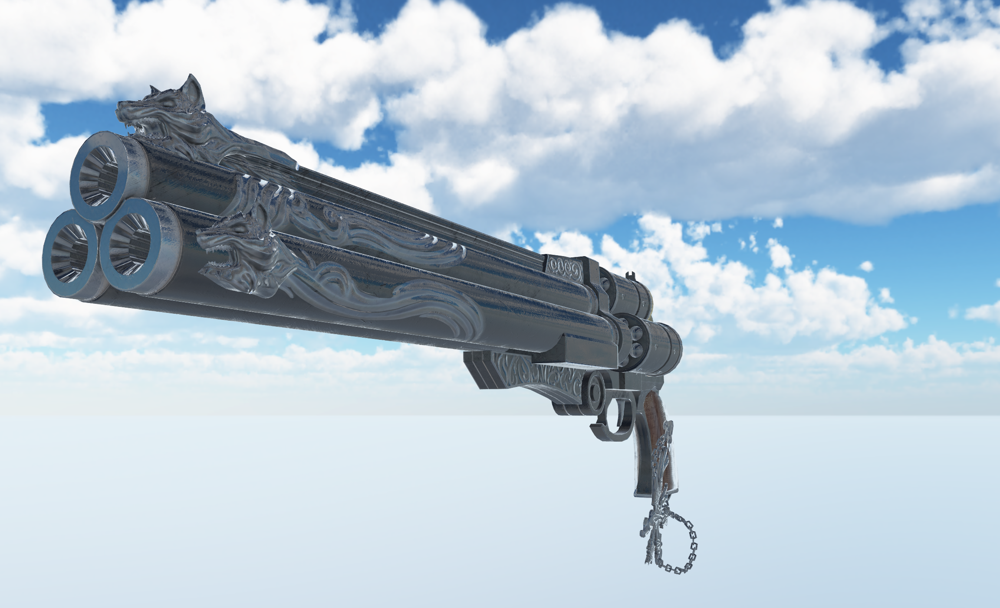
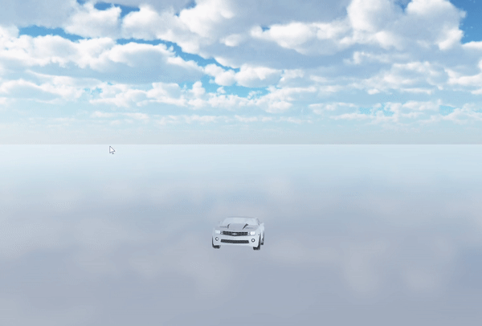

# Neon
Continuing from https://github.com/fhusnjak/Neon
## C++ Vulkan engine

Personal project for practicing Vulkan, C++, Physics and graphics programming principles.

## Current features:
### PBR lighting 
 

### Ocean simulation using FFT 
 

### Integrated PhysX physics engine, added custom support for adding physics bodies to different parts of skeletal meshes 
 
