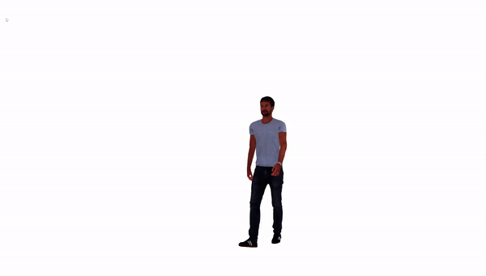
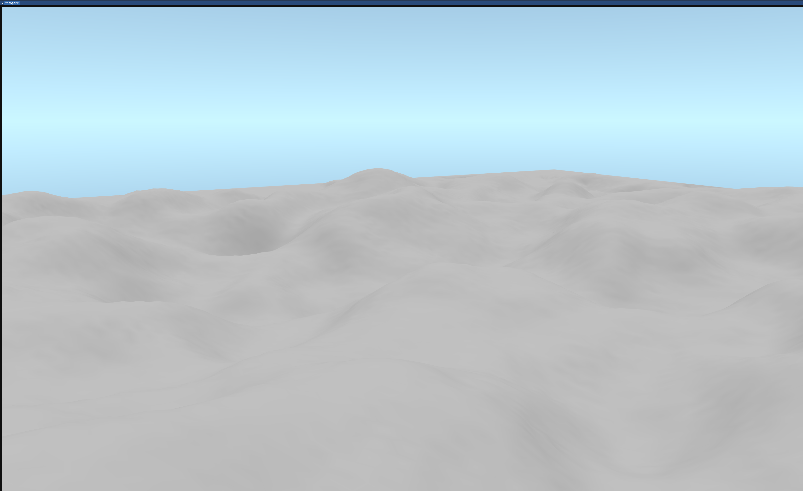

# Neon
## C++ Vulkan engine

Personal project for practicing Vulkan and graphics programming principles.

## Current features:
### Phong lighting 

### Skeletal animation 
 

### Terrain generation from heightmaps 
 

### Multitexturing 
 

### Water 
 
